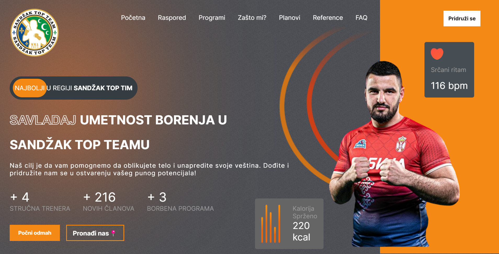

Combat Sport Gym🥋
Welcome to the Combat Sport Gym repository! This repository contains the code and resources for the Combat Sport Gym website. Our website is designed to provide visitors with comprehensive information about our training schedules, prices, programs, location, frequently asked questions (FAQ), contact details, and testimonials from our members.

  

Table of Contents
About
Features
Installation
Usage
Contributing
License
Contact
About
Combat Sport Gym is a premier training facility dedicated to providing high-quality training in various combat sports. Whether you are a beginner or a seasoned athlete, we have programs that cater to all skill levels. Our experienced trainers and state-of-the-art facilities ensure that you receive the best training experience possible.

Features
Training Schedules: Up-to-date information on our training schedules to help you plan your sessions.
Prices: Detailed pricing information for our different training programs and membership options.
Programs: Descriptions of the various training programs we offer, including boxing, MMA, kickboxing, and more.
Location: Our gym's address and a map to help you find us easily.
FAQ: Answers to the most commonly asked questions about our gym and training programs.
Contact: Information on how to get in touch with us for any inquiries or support.
Testimonials: Feedback and reviews from our members about their experiences at our gym.
